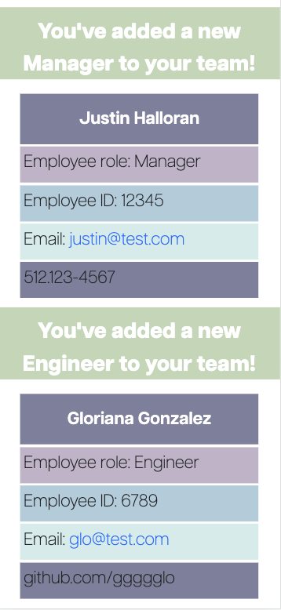

# Team Member Tracker

# Description
A simple application in order to keep track of your new team members and their data. 

# Objectives
An application that when started:
    - Will prompt the user to ask questions about their new team members
    - Will create an HTML with the new data
    - Will not overwrite data
    - Will prompt the team member's email to write a new email
    - Will prompt the team member's github to their GitHub link
    - Will test all classes in order to meet expectations
    - Will have classes for the different roles an employee can have

# Website Images
